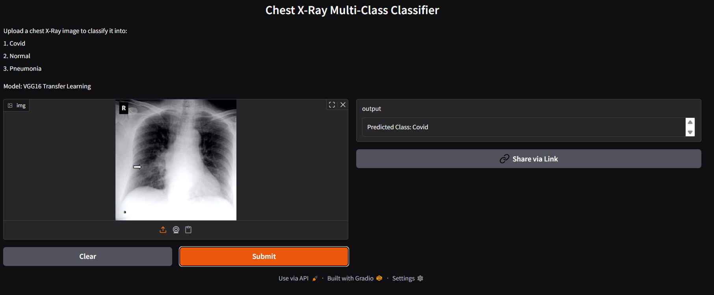
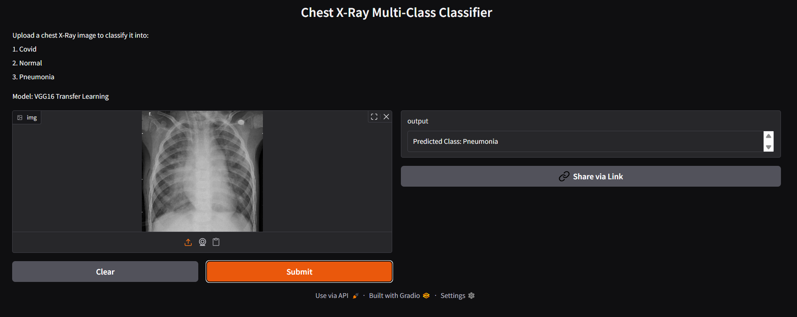

# 🩺 Chest X-Ray Multi-Class Classifier
COVID-19 | Pneumonia | Normal Detection using VGG16 + Transfer Learning

This project is an end-to-end deep learning pipeline that classifies chest X-ray images into COVID-19, Pneumonia, and Normal categories. It includes model training, evaluation, experiment tracking, reproducible pipelines, and deployment using Gradio on Hugging Face Spaces.

# 🚀 Features

- VGG16-based CNN model with transfer learning

- Trained on 5,000+ chest X-ray images across 3 classes

- Data augmentation for improved generalization

- DVC pipeline for reproducible ML workflow

- MLflow for experiment tracking & model versioning

- Gradio-based web app with real-time predictions

- Deployed on Hugging Face Spaces

- Returns class label 

# 📂 Project Structure

Chest-X-Ray-Multiclass-Classifier/

│── artifacts/                 # DVC-tracked data & models

│── src/cnn_classifier/

│     ├── components/          # Training, evaluation modules

│     ├── pipeline/            # Training & prediction pipelines

│     ├── utils/               # Helper utilities

│── app.py                     # Flask/Gradio app (optional)

│── gradio_app.py              # App used for deployment

│── model/                     # Saved trained model

│── params.yaml                # Hyperparameters

│── config.yaml                # Configuration file

│── scores.json                # Evaluation metrics

│── requirements.txt

│── README.md

# 🧠 Model Performance
Metric	Validation	Evaluation (Test Split)
- Accuracy	~87%	~94%
- Loss	~0.49	~0.22
  
# 🛠 Tech Stack

- Python

- TensorFlow / Keras

- VGG16 (ImageNet weights)

- MLflow

- DVC

- Gradio

- Hugging Face Spaces

- Flask (optional)

# ▶️ How to Run Locally

1️⃣ Clone the repository
```
git clone https://github.com/<your-username>/Chest-X-Ray-Multiclass-Classifier.git
```

```
cd Chest-X-Ray-Multiclass-Classifier
```

2️⃣ Install dependencies

```
pip install -r requirements.txt
```

3️⃣ Train the model

```
python main.py
```

4️⃣ Launch the Gradio app
```
python gradio_app.py
```

# 🌐 Deployment (Hugging Face Spaces)

This project is deployed on Hugging Face Spaces using Gradio.

* To deploy your own Space:

-- Create a new Space → choose Gradio

-- Upload:

-- gradio_app.py

-- requirements.txt

-- model/ folder

-- README.md

-- Commit and the app will auto-build.


# 📝 Project Highlights

- Achieved 94% evaluation accuracy using VGG16 transfer learning

- Applied data augmentation to reduce overfitting

- Built an end-to-end ML pipeline with DVC

- Tracked hyperparameters + metrics using MLflow

- Deployed a real-time inference app on Hugging Face with Gradio


# 📸 App Screenshot




# 🚀 Demo

Try the live app here: [Chest X-Ray Multiclass Classifier](https://huggingface.co/spaces/srinija1176/Chest-X-Ray-Multiclass-Classifier)